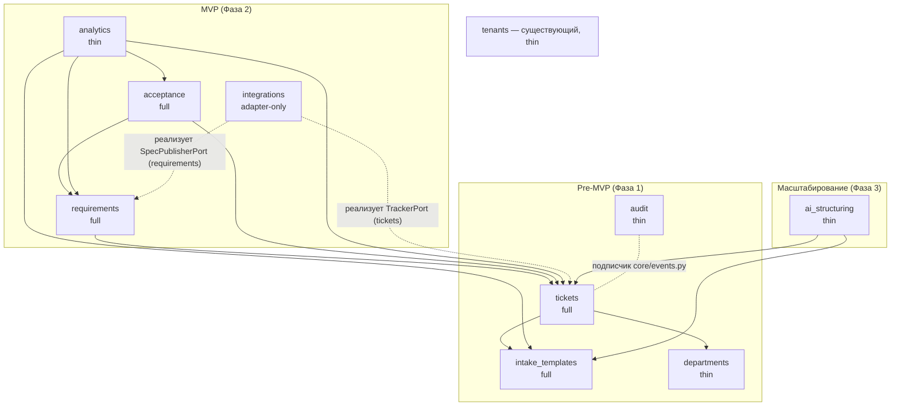

# Карта модулей продукта

> Декомпозиция бэкенда системы структурированного приёма бизнес-запросов
> (AI Business Analyst, платформа BuildX / Beeline Uzbekistan) на bounded-context
> модули под `backend/src/app/modules/<name>/`. Источник истины по домену —
> `AI_Business_Analyst_System.md`; архитектурная база — существующий монолит
> (FastAPI + Postgres schema-per-tenant + Keycloak BFF/OIDC + Redis), см. `CLAUDE.md`
> и `docs/MODULES.md`. Ссылки вида §N — на разделы брифа.

## 1. Обзор

Продукт превращает вербальный размытый запрос в структурированный, прослеживаемый
и измеримый артефакт: шаблоны приёма → управляемый 7-статусный workflow →
фиксация «было/стало» → ТЗ → двойная приёмка (формальный DoD у BA + ценность у
бизнес-заказчика) → сквозная аналитика (§1, §4).

Ключевые принципы декомпозиции:

- **Ядро домена — тикет** (§13): агрегат `Ticket` с единым ядром метаданных и
  guard-переходами; оба сигнатурных инварианта продукта («в работу только после
  согласованного ТЗ», «закрыт только после двойного гейта») — guard'ы переходов
  тикета, проверяемые через порты.
- **Два статусных enum'а — два типа**: `TicketStatus` (7 состояний, workflow заявки, §4)
  и `ArtifactStatus` (5 состояний, жизненный цикл артефакта требований, §6.1) живут
  в разных модулях, никогда не синхронизируются автоматически.
- **Решение по трекеру (§10) ОТКРЫТО** — вся трекер-специфика за портом
  `TrackerPort` (объявлен в `tickets/domain/ports.py`); Pre-MVP обходится
  `NullTrackerGateway`, реальный адаптер пишется в `integrations` после решения.
  Локальный Postgres — всегда system of record.
- **Отдел = tenant ОТКРЫТО** — единственное место, знающее ответ, — модуль
  `departments` (порт `DataZonePolicy`); все остальные несут opaque `department_id`.
- **Комплаенс архитектурно** (§8, §13): аудит — синхронный подписчик доменных
  событий в той же транзакции; человеческий контроль — структурный (у ИИ нет
  портов переходов); ПДн — резидентность + PII-эгресс-фильтр + UUID в аналитике.
- **Минимальная Фаза 1**: ровно четыре новых модуля + `core/events.py`; всё
  остальное — зарезервированные швы (колонки, порты, append-only истории), а не код.

## 2. Диаграмма зависимостей

Стрелки — declared-зависимости (импорт кода); пунктир — инверсия зависимостей:
порт объявлен у потребителя, адаптер — у поставщика. Циклов нет: цикл
ddd-предложения (tickets → acceptance → change_capture → tickets) разрешён тем,
что `tickets` объявляет порты `SpecApprovalGate` / `AcceptanceGate` /
`TrackerPort` в своём `domain/ports.py`, а адаптеры подключаются в composition
root (`api/v1/__init__.py` + providers).

## 3. Сводная таблица модулей

| Модуль | Вариант | Фаза | Назначение (кратко) | Зависит от |
|---|---|---|---|---|
| `tickets` | full | Pre-MVP | Агрегат заявки, 7-статусный workflow, триаж, план сроков | `intake_templates`, `departments` |
| `intake_templates` | full | Pre-MVP | Версионируемый каталог форм приёма + обязательное ядро §6.3 | — |
| `departments` | thin | Pre-MVP | Справочник отделов, членство, зоны данных; хедж «отдел=tenant» | — |
| `audit` | thin | Pre-MVP | Append-only аудит каждого действия, та же транзакция | — (события) |
| `requirements` | full | MVP | Артефакты ТЗ, 5-статусный lifecycle, items, трассируемость §6.2 | `tickets` |
| `acceptance` | full | MVP | «Было/стало» + двойной гейт + протокол приёмки | `tickets`, `requirements` |
| `analytics` | thin | MVP | Read-only метрики §2 (SQL query services) | `tickets`, `intake_templates`, `requirements`, `acceptance` |
| `notifications` | thin | Pre-MVP | Pull-лента событий по своим заявкам + поэлементные отметки «прочитано»; выводится из `audit_entries`, своей ленты не хранит | — (читает `audit`, `tickets`) |
| `integrations` | adapter-only | MVP | Адаптеры трекера/Confluence/источников, outbox, PII-эгресс | `tickets`, `requirements` |
| `ai_structuring` | thin | Scale | AI-структуризация свободной формы, suggest-only | `intake_templates`, `tickets` |
| `tenants` | thin | Pre-MVP | Существующий провижининг организаций — как есть | — |

## 4. Модули

### 4.1. `tickets` — full, Pre-MVP

**Назначение.** System of record для заявки: агрегат `Ticket` с workflow
`Создан → Триаж → ТЗ/Согласование → В работе → Фиксация изменений → Приёмка → Закрыт / Отклонён`
(§4), триаж, маршрутизация, назначения ролей по тикету, план сроков.

**Сущности.**
- `Ticket` (aggregate root) + `TicketStatus` — 7-state `StrEnum` со своим DB CHECK
  (паттерн `tasks_status_chk`) и **явными rework-рёбрами**: `Приёмка → В работе`
  (провал любого гейта), `Триаж → Создан` (возврат на дозаполнение), ветка
  `Отклонён` также после Приёмки. Без записанных возвратов метрика §2
  «≥70% без возврата» невычислима. Точный набор рёбер — подтвердить у PO
  (открытый вопрос) до заморозки guard'ов.
- `StatusTransition` — append-only история (from, to, actor, comment, occurred_at)
  **с первой миграции Фазы 1** — несущая конвенция: именно она позволяет отложить
  весь модуль `analytics` до MVP.
- `IntakeSubmission` — снапшот `template_version_id` + JSONB обязательного ядра
  §6.3 (проблема, ожидаемый результат + измеримая метрика, AS-IS/TO-BE, затронутые
  системы, срочность/срок, AC-текст). **Неизменяем после триажа** (поправки —
  новыми версиями) — требование §8 и стабильность метрики ≥80%.
- `TriageDecision` — полнота / дубль / маршрутизация / отклонение с причиной.
- `Assignment` — назначенные `business_owner` и `executor` этого тикета: база
  per-object прав (value-гейт подписывает именно этот бизнес-заказчик).
- `ApprovalDecision` [MVP] — неизменяемое записанное решение Согласующего по
  M+ инициативе (§3): не голый role-check (пробел phasing) и не отдельный модуль
  `approvals` (см. ниже) — §8 требует «историю согласований».
- `PlanCommitment` [MVP] — плановые сроки/оценка, фиксируются на переходе
  `ТЗ/Согласование → В работе`. Взят из compliance-предложения: без него метрика
  §2 «отклонение факт/план ≤20%» (exit-критерий MVP) не имеет write-стороны.

**Порты** (`tickets/domain/ports.py`, паттерн `tasks/domain/ports.py`):
- `TicketRepository`;
- `TrackerPort` — `mirror_create`, `mirror_transition`, `pull_updates`,
  **`open_defects_query`** (нужен формальному гейту «нет P0/P1») + определённый
  system-actor путь для webhook-переходов через ролевые guard'ы. Дефолтный
  адаптер `NullTrackerGateway` — в `tickets/infrastructure`;
- `SpecApprovalGate` — guard «В работу только после Утверждён» (адаптер даёт
  `requirements`);
- `AcceptanceGate` — guard «Закрыт только при полном протоколе двойного гейта»
  (адаптер даёт `acceptance`); чтение — read-only внутри транзакции перехода
  (одна tenant-схема ⇒ консистентно без слияния агрегатов).

**Спорное и как решено.** (1) Цикл ddd-предложения разрешён инверсией портов —
declared-зависимости `tickets` сжаты до `intake_templates` + `departments`.
(2) «Типовая защита» `AcceptanceVerdict` из arch_fit отвергнута: Python не
ограничивает конструирование, а размещение VO в `acceptance` дало бы цикл
импортов; guard — это порт. (3) Отдельный pre-MVP модуль трекера (ddd,
compliance) отвергнут: §9 говорит «платформа выбрана» на выходе Discovery,
хедж до решения — Protocol + `NullTrackerGateway` внутри `tickets`.
(4) Триаж — не отдельный контекст: это стадия жизни тикета, его решения мутируют
тикет транзакционно.

**API.** `/api/v1/tickets` + action-POSTs (`/triage`, `/reject`, `/approve-m-plus`,
`/start-work`, `/return-to-work`, `/close`) по образцу `/tasks/{id}/start`;
плюс pre-MVP endpoint `/api/v1/tickets/stats/intake-share` (см. `analytics`).

### 4.2. `intake_templates` — full, Pre-MVP

**Назначение.** Версионируемый каталог форм приёма (§5): шесть типов
(feature_request / change / defect / integration_data / analytics_request /
free_form) + валидация подач.

**Сущности.** `Template`, `TemplateVersion` (published — неизменяема),
`FieldDefinition` (JSONB-схема), `MandatoryCore` (инвариант: каждая публикуемая
версия содержит обязательное ядро §5/§6.3), `TemplateSelectionRule` (§6.4).
Порт `SubmissionValidator` — потребляется `tickets`.

**Решения.**
- **Свободная форма = встроенный системный шаблон**, несущий только
  `MandatoryCore` (принято из ddd/arch_fit): один путь валидации для всех подач;
  в Фазе 3 `ai_structuring` целится в те же `FieldDefinition`-схемы.
- **Confluence в Фазе 1 — ручная кураторская задача**, не runtime-интеграция:
  «база шаблонов формируется из примеров в Confluence» (§5) — чтение phasing/scope
  принято, arch_fit-порт `ConfluenceCatalogSource` в Pre-MVP отвергнут.
- Привязка «Цель бизнеса → BG» (§6.3): в Фазе 1 — обязательное текстовое поле;
  nullable `bg_item_id` в `requirements` появляется в MVP (закрытие фазовой дыры).

**API.** `/api/v1/templates`.

### 4.3. `departments` — thin, Pre-MVP

**Назначение.** Справочник отделов, членство, зоны данных (§8) и цели
маршрутизации триажа. **Единственное место, знающее ответ на открытый вопрос
«отдел = tenant»**.

**Сущности.** `Department`, `DepartmentMembership` (в БД, не в JWT — tenant_id
остаётся единственным доверенным клеймом, инвариант `core/tenancy.py`),
`RoutingRule` [MVP]. Порт `DataZonePolicy` / `DepartmentResolver` — потребляется
через `core/authz.py`.

**Решения.** Единое имя `departments` (вместо org_directory / org_structure);
`UserProfile` из compliance отброшен — идентичностью владеет Keycloak. Таблицы —
на tenant-ветке Alembic. Дефолт: **один tenant на юрлицо, отделы строками**;
исход tenant-per-department поглощается свапом адаптера резолвера + существующей
провижининг-сагой `tenants` (1:1 строка на схему). Фаза 1 гарантирует только шов
(`department_id` на каждом тикете + один посеянный отдел); DataZone-фильтр
строится в Фазе 2 при подключении второго отдела.

**API.** `/api/v1/departments`.

### 4.4. `audit` — thin, Pre-MVP

**Назначение.** Append-only аудит каждого действия по тикетам и артефактам
(§8: «полные аудит-логи», «полная история изменений и согласований») с API
чтения истории.

**Сущности.** `AuditEntry` (actor, роль, entity ref, action, before/after diff,
request_id, occurred_at); `RetentionPolicy` — позже.

**Решения.**
- **Модель консистентности решена**: синхронный подписчик на `core/events.py`
  пишет `AuditEntry` через тот же `AsyncSession` (flush(), never commit() —
  коммитит SessionDep), т.е. аудит-строка **атомарна** с изменением. Eventual-аудит
  из ddd (outbox-проекция) отвергнут: хвост может потеряться при падении.
- Никто не пишет в аудит напрямую — только подписчик: эмиссия доменного события
  И ЕСТЬ акт аудита, покрытие структурно.
- INSERT-only на уровне грантов Postgres (из compliance-предложения).
- Таблица на tenant-ветке: аудит — отдельские/персональные данные (§8, локализация).
- Выходит в Pre-MVP: статусная модель Фазы 1 уже порождает юридически значимую
  историю; ретрофит аудита = навсегда потерянная история.

**API.** `/api/v1/audit` (гейт `require_roles`).

### 4.5. `requirements` — full, MVP

**Назначение.** Артефакты требований (BRD / SRS / Use Case / Change Spec) с
единым ядром метаданных §6.1, **отдельным** 5-статусным жизненным циклом
(`Черновик → На согласовании → Утверждён → В работе → Закрыт`), версионированием,
протоколом согласования и полным графом трассируемости §6.2.

**Сущности.** `Artifact` (+ `ArtifactStatus`, свой DB CHECK), `ArtifactVersion`
(неизменяемые снапшоты; версия документа в MVP, per-item — путь открыт),
`RequirementItem` (kind: `BG | BR | RULE | UC | US | FR | NFR | AC | TC` —
**BR ≠ RULE**, исправленная коллизия §6.2 закодирована в типе), `TraceLink`
(инвариант порядка цепочки `TC→AC→FR/NFR→UC/US→BR→BG` — доменное правило),
`PrefixedIdSequence` (per-tenant выдача `BG-XX`/`FR-XX`), `SpecApprovalRecord`
(решение и флип `На согласовании → Утверждён` — одна транзакция одного агрегата),
`ImpactAnalysis` (секция/тип артефакта при Change Spec — трек Б §7).

**Спорное и как решено.**
- **`trace_links` как модуль (ddd) убит** — единогласно по всем критикам: цепочка
  §6.2 целиком внутри артефактов requirements, «Связи» — поле шапки §6.1
  (ubiquitous language контекста); в одной tenant-схеме обычные FK дают
  целостность бесплатно.
- **Отдельный модуль `approvals` (arch_fit/compliance) убит**: cross-module
  драйв чужого статусного перехода — расщеплённый агрегат. `SpecApprovalRecord`
  живёт здесь; M+ решение — в `tickets`; единая история согласований собирается
  модулем `audit` через события. Generic-approvals вернётся на рассмотрение,
  только если discovery подтвердит ≥3 формальных вида sign-off.
- **§7 закрыт явно**: Impact Analysis — артефакт/секция здесь; декомпозиция
  Epic→Feature→Story объявлена tracker-side за `TrackerPort` (фиксируется в
  README модуля, чтобы §7 не потерялся молча).
- **Мост AC**: BA на статусе 3 промотирует AC-текст из `IntakeSubmission` в
  формальные `AC-XX` items — их читает формальный гейт приёмки.
- Артефакт крепится к тикету через `source_ticket_id` FK; статусы артефакта и
  тикета никогда не синхронизируются автоматически.

**API.** `/api/v1/tickets/{id}/artifacts`, `/api/v1/artifacts/{id}/items`,
`/api/v1/requirements/{key}/trace`.

### 4.6. `acceptance` — full, MVP

**Назначение.** Фиксация «было/стало» (статус 5, §4) и двойной гейт приёмки
(статус 6): формальный DoD-вердикт BA + ценностный вердикт бизнес-заказчика,
с неизменяемым протоколом и доказательной базой.

**Сущности.** `ChangeRecord` (снапшоты было/стало + `MetricDelta` против
заявленной метрики успеха из intake; неизменяем после `finalize()`),
`GateDecision` (kind: `formal_dod | business_value`; только человек-Principal
нужной роли; неизменяемо после подписи), `AcceptanceProtocol` (полон ⇔ оба
решения есть — сам протокол входит в определение DoD §4), `AcChecklistResult`,
`P0P1Attestation` (аттестуемый BA флаг + evidence ref), `EvidenceRef` + порт
`EvidencePort`.

**Спорное и как решено — самый конфликтный шов карты.**
- Отвергнуто **вкладывание в Ticket** (phasing, boundaries-критика): юридически
  значимые immutable-after-signing записи (§8) не должны жить в рутинно
  редактируемом агрегате — неизменяемость выродилась бы в конвенцию.
- Отвергнут **веер из трёх модулей** (ddd: acceptance + change_capture; arch_fit:
  + approvals): `ChangeRecord` и `GateDecision` разделяют один режим
  «неизменяемо после подписи», одну фазу и одну доказательную цепочку — принята
  рекомендация scope-критики: **один модуль**. Разные акторы (Исполнитель
  фиксирует, BA и бизнес подписывают) — правила отдельных сущностей; модуль ≠ агрегат.
- Сохранён сильнейший инсайт ddd: **заявленные** AS-IS/TO-BE (intake, §6.3) и
  **фактические** было/стало — разные сущности разных модулей.
- Гейт «нет открытых P0/P1» получил владельца: аттестация на `FormalGateVerdict`
  в MVP, апгрейд до живого `TrackerPort`-запроса после §10; завершение гейта
  **никогда** не зависит синхронно от доступности трекера.
- `tickets` потребляет полноту протокола через свой порт `AcceptanceGate`
  (read-only в транзакции перехода `Закрыт`) — инвариант остаётся у тикета,
  протокол — здесь.

**API.** `/api/v1/tickets/{id}/changes`, `/api/v1/tickets/{id}/acceptance`.

### 4.7. `analytics` — thin, MVP

**Назначение.** Сквозная аналитика (§1, §2, §9): read-only метрики — доля
шаблонных заявок, доля без возврата, отклонение факт/план, покрытие, доля
подтверждённой ценности, время цикла по статусам.

**Сущности (query services, без domain-слоя).** `TicketFlowStats`,
`StatusDwellTime`, `TemplateUsageStats`, `PlanVsFactStats`,
`ValueConfirmationStats`, `ReworkStats`.

**Решения.** Спор «event-fed проекции + outbox» (ddd/compliance) vs «простые SQL»
(phasing) решён в пользу простоты: на масштабе 2–3 отделов — тонкие SQL-сервисы
над append-only таблицами источников; без warehouse, без outbox-консьюмеров.
Правило compliance «никогда не читать чужие таблицы» отвергнуто как
преждевременное. Стабильный контракт — `/api/v1/analytics/*`; в Фазе 3 реализацию
можно подменить на проекции. **Pre-MVP срез**: счётчик доли шаблонных подач
(exit-критерий Фазы 1) живёт в `tickets` как простой endpoint по собственной
таблице — модуль analytics не вытягивается вперёд. Fact-данные — только UUID
субъектов (§8 ПДн).

### 4.8. `integrations` — adapter-only, MVP

**Назначение.** Anti-corruption layer внешних систем: адаптер трекера
(Jira ИЛИ собственный — по исходу §10), позже Confluence-публикация и
MCP-коннекторы источников данных; надёжная доставка наружу.

**Сущности/адаптеры.** `TrackerIssueMapping`, `JiraTrackerGateway |
InternalTrackerGateway` (пишутся только после решения §10), `OutboxEntry`
(at-least-once доставка наружу; прецедент неатомарности — провижининг-сага
`tenants`), `ConnectorConfig` (per-tenant креды, шифрование как в
`core/crypto.py`), `SyncCursor`; `ConfluencePublisher` и `DataSourceAdapter` —
Фаза 3 (MVP экспортирует ТЗ как rendered markdown; `requirements` — всегда
source of record, Confluence — проекция).

**Решения.** Направление зависимостей — суть паттерна: все порты объявлены у
потребителей (`TrackerPort` в tickets, `SpecPublisherPort` в requirements,
`MetricProviderPort` в acceptance) — исход §10 меняет адаптер, не контексты.
Outbox живёт **только** здесь. Вместе с первым адаптером (не раньше и не позже)
поставляется `core/pii.py` — allowlist/редакция PII на все исходящие payload'ы
(§8: Jira Cloud вне контура резидентности РУз). Переходы Триаж/Приёмка/Закрыт —
исключительно у `tickets`: двойной гейт нельзя обойти из Jira.

**API.** `/api/v1/integrations` (конфиг, health, webhooks).

### 4.9. `ai_structuring` — thin, Scale (Фаза 3)

**Назначение.** AI-структуризация свободной формы (§9 Фаза 3): классификация под
шаблон, извлечение полей ядра, черновики требований — строго предложения,
подтверждаемые человеком.

**Сущности.** `StructuringProposal` (proposed/accepted/edited/rejected),
`FieldExtraction`, порт `LlmPort`.

**Решения.** Не скаффолдить раньше Фазы 3 (единогласно). §8 «человеческий
контроль» — **структурно**: в поверхности зависимостей только порты создания
черновиков; портов переходов/утверждений нет — вывод ИИ физически не может стать
решением; применение предложения — обычная аудируемая ролевая команда человека
в `tickets`. Черновики проходят ту же валидацию `MandatoryCore`.

### 4.10. `tenants` — существующий, thin, Pre-MVP

Провижининг организаций (public-реестр, Keycloak-группа, tenant-схема, первый
админ) остаётся как есть. Под любым исходом «отдел = tenant» это механизм
провижининга; единственная public-head таблица. `modules/tasks` остаётся
референс-шаблоном и в продуктовую декомпозицию не входит.

## 5. Сквозные решения

| Забота | Где живёт | Решение |
|---|---|---|
| Доменные события | `core/events.py` (новый) | Синхронный in-process диспетчер, без брокера. Подписчики — в том же запросе и `AsyncSession`: побочные записи атомарны под SessionDep (flush, never commit). Outbox — только в `integrations` для внешних эффектов. Event sourcing отвергнут: state-таблицы + append-only истории + неизменяемые версии покрывают §8 и не воюют с двухголовым Alembic. |
| Аудит | эмиссия — события; сток — `modules/audit` | Публикация события = акт аудита; прямых записей нет ни у кого. Та же транзакция; INSERT-only гранты; request_id/actor из существующего RequestContextMiddleware. |
| RBAC | Keycloak + `core/deps.py` + домен | Realm-роли `ba`, `business_owner`, `executor`, `approver` (Заявитель = `tenant_user`) уже добавлены в `realm-export.json`, вместе с seed-пользователями по одному на роль (`requester`, `ba`, `business_owner`, `executor`, `approver`); endpoints — `require_roles()`; per-object права (business_owner этого тикета) — из DB `Assignment`/членства в application-сервисах (паттерн owner-vs-admin из tasks); правила «кто выполняет переход §4» продублированы как доменные инварианты в transition-методах. |
| Зоны данных отделов (§8) | `core/authz.py` + порт `departments` | `DataZoneDep` после PrincipalDep/TenantDep резолвит scope из БД по subject (никогда из input). Фаза 1 — только шов (`department_id`); фильтр — в Фазе 2. |
| Трассируемость (§6.2) | `requirements/domain` | Не core и не отдельный модуль. `TraceLink` + порядок цепочки + префиксные ID — доменные правила requirements; межмодульные ссылки — обычные FK. |
| Два статусных enum'а | `tickets/domain`, `requirements/domain` | `TicketStatus` (7) и `ArtifactStatus` (5) — разные `StrEnum` с разными DB CHECK; одноимённые состояния не синхронизируются. |
| Трекер (§10 ОТКРЫТО) | порт в `tickets/domain/ports.py`; адаптеры в `integrations` | Postgres — SoR всех 7 статусов; трекер зеркалирует исполнение; `NullTrackerGateway` до решения; порт включает запрос P0/P1 и system-actor путь для webhook. Решение «Jira в месяце N» трогает только `integrations` + `validate_for_production()`. |
| ПДн / локализация РУз (§8) | deployment + `core/pii.py` + analytics | UZ-резидентная инфраструктура, ассерты в `validate_for_production()` (MVP); PII-эгресс-allowlist вместе с первым внешним адаптером; в fact-данных только UUID; шифрование полей — `core/crypto.py`. |
| Человеческий контроль (§8) | структура зависимостей | Гейты/переходы требуют человека-Principal; у `ai_structuring` нет портов переходов/утверждений — контроль по построению. |
| Alembic | tenant-ветка | Все новые таблицы — `{"info": {"tenant_scope": "tenant"}}`; public-head — только `public.tenants`. Держит оба исхода «отдел=tenant» открытыми. |
| Доказательства (файлы) | порт `EvidencePort` в `acceptance` | Решение S3-совместимый стор vs bytea — именованный чекпоинт до заморозки MVP-схемы. |
| Уведомления (§3) | `modules/notifications` (pull-часть реализована) | Фазы 1–2 — pull-модель: `GET /api/v1/notifications` выводит ленту из `audit_entries` по участию в заявке (автор / активное назначение / ранее действовал; роль `ba` дополнительно видит очередь `submitted`+`acceptance_requested`), своих событий актору не показывает; единственная хранимая таблица — `notification_reads`, по строке на (пользователь, событие): отметка поэлементная, а не watermark, иначе «погасить одно уведомление» гасило бы и все более старые. Наружу отдаются только `{ticket_id, ticket_title, action, actor, occurred_at}` — `before`/`after`/`roles` остаются за гейтом `/api/v1/audit`. Фронт опрашивает раз в минуту; в панели по умолчанию только непрочитанные, кнопка «Все» показывает последние 20 событий вместе с прочитанными (без пагинации). Push / тонкий потребитель на шине событий — по-прежнему после MVP: шина fail-closed и делит транзакцию с записью тикета, вывод на чтении ретроактивен и не требует бэкфилла. |
| Ошибки / envelope / rate-limit / CSRF | `core/*` как есть | DomainError-подклассы per-module; `{error, meta}` + x-request-id; `check_rate_limit`/`check_csrf` как router-deps по образцу tasks; BFF/OIDC и same-origin `/api/v1`-прокси не трогаются. |

## 6. Порядок сборки

1. **`tenants`** — уже существует; провижининг и BFF/OIDC-ядро переиспользуются (точка отсчёта).
2. **`departments`** — без зависимостей; шов `department_id` и порт `DataZonePolicy` нужны всем с первой миграции.
3. **`intake_templates`** — без зависимостей; каталог и валидатор ядра обязаны существовать до первой подачи.
4. **`audit` + `core/events.py`** — диспетчер и append-only сток до первой продуктовой мутации: история полна с нулевого дня (§8).
5. **`tickets`** — ядро Фазы 1: агрегат, 7-статусная машина с rework-рёбрами, `StatusTransition`, триаж, `NullTrackerGateway`.
6. **`requirements`** — старт MVP: артефакты, lifecycle, items, `TraceLink`, `SpecApprovalRecord`; включается guard «В работу только после Утверждён».
7. **`acceptance`** — после requirements: было/стало + двойной гейт + протокол; замыкается guard `Закрыт`; параллельно в `tickets` добавляются `PlanCommitment` и `ApprovalDecision` (M+).
8. **`analytics`** — последним в MVP: SQL-сервисы над уже накопленными историями.
9. **`integrations`** — при написании первого реального адаптера после решения §10 (вместе с `core/pii.py` и outbox).
10. **`ai_structuring`** — Фаза 3; раньше не скаффолдить.

## 7. Соответствие exit-критериям (§9) и метрикам (§2)

| Критерий | Обеспечивают | Механизм |
|---|---|---|
| Ф1: ≥80% запросов через шаблон | `intake_templates`, `tickets` | Free-form = системный шаблон ⇒ каждый `IntakeSubmission` несёт неизменяемый `template_version_id`; pre-MVP счётчик — endpoint в `tickets` (analytics поглощает его в MVP). |
| Ф1: статусная модель + триаж на 1 отделе | `tickets`, `departments`, `audit` | 7-статусная машина + `StatusTransition` с первого релиза; один посеянный отдел; аудит с нулевого дня. |
| Ф2: 100% тикетов в системе | `tickets`, `integrations`, `analytics` | Postgres — SoR независимо от исхода §10; трекер — зеркало; покрытие считает analytics. |
| Ф2: отклонение сроков ≤20% | `tickets` (`PlanCommitment`), `analytics` | План фиксируется на гейте ТЗ; факт — из `StatusTransition`. |
| Ф2: ≥70% без возврата (§2) | `tickets`, `analytics` | Явные rework-рёбра, записанные в append-only историю. |
| Ф2: ≥60% с зафиксированным value (§2) | `acceptance`, `analytics` | `GateDecision(business_value)` + `ChangeRecord.MetricDelta`. |
| Ф3: охват ≥80% отделов | `departments`, `tenants`, `ai_structuring` | Onboarding отделов через departments/провижининг; AI-структуризация свободной формы. |

## 8. Открытые вопросы

1. **Rework-рёбра**: точный набор возвратных переходов (минимум `Приёмка → В работе`; `Триаж → Создан`; исход провала value-гейта — `Отклонён` или цикл?) — подтвердить у PO до заморозки guard'ов Фазы 1; от этого зависит метрика «≥70% без возврата».
2. **Трекер (§10)**: при выборе Jira — подтвердить, что Jira только зеркало исполнения (Postgres — SoR, иначе ломаются 100% покрытие и аудит); webhook vs polling; разрешение конфликтов статусов; Cloud vs Data Center критично для ПДн РУз.
3. **Отдел = tenant**: дефолт — один tenant на юрлицо; решить до раскатки Фазы 2 на 2–3 отдела. При tenant-per-department — определить путь сквозной аналитики (public-head read-модели vs fan-out под `platform_admin`).
4. **Скоупинг ролей**: департаментно-скоупна ли роль BA? Realm-роли глобальны; при необходимости привязка уезжает в `DepartmentMembership`.
5. **TC-XX**: нативно в `requirements` или во внешнем тест-инструменте по ссылке через будущий адаптер?
6. **P0/P1**: достаточно ли юридически ручной аттестации BA на период MVP (принято как дефолт) до перехода на живой запрос `TrackerPort`?
7. **ПДн vs append-only аудит**: retention и запросы на стирание против неизменяемых строк (псевдонимизация vs legal-hold) — юр. заключение ДО заморозки схемы `audit` в Фазе 1.
8. **Хранилище доказательств**: S3-совместимый стор vs Postgres bytea — чекпоинт до заморозки MVP-схемы `acceptance`.
9. **Порог M+** для Согласующего: какое правило размера триггерит `ApprovalDecision`; параллельное согласование или состояние?
10. **Свободная форма**: какие поля `MandatoryCore` жёстко блокируют подачу vs дозаполняются на триаже — нужны данные discovery (риск искажения метрики ≥80% абандоном).
11. **Мастеринг артефактов**: нативный структурированный контент в `requirements` (рекомендовано) vs Confluence-страницы с метаданными у нас.
12. **«В стиле MCP» (§8)**: буквальный wire-протокол MCP или философия плагинов — влияет на форму адаптеров `integrations`.
13. **Версионирование артефактов**: document-level в MVP (принято); подтвердить путь апгрейда до per-item.
14. **Уведомления**: pull-часть Фаз 1–2 реализована (`modules/notifications`). Открытым остаётся только push после MVP — подтвердить у PO отсрочку тонкого потребителя событий.
