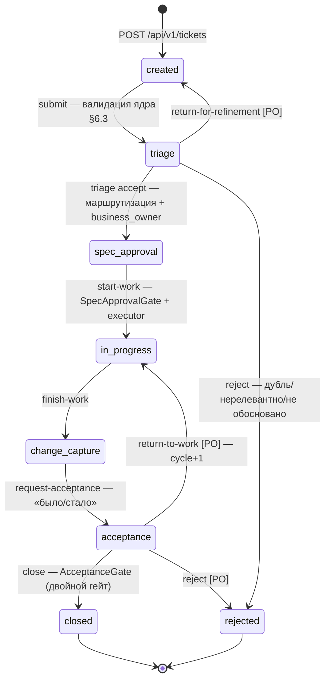

# Модуль `tickets` — Фаза 1 (Pre-MVP): проектное решение

> Файл: `docs/design/tickets-phase1.md`. Источники: `docs/PRODUCT_MODULES.md` §4.1 (согласованная спецификация модуля), `AI_Business_Analyst_System.md` §3/§4/§6.3/§13, `CLAUDE.md` (архитектурные инварианты), фактический код `core/events.py`, `modules/audit`, `modules/intake_templates`, `modules/departments`, `modules/tasks` (референс-идиомы), цепочка миграций до `0005_tenant_audit`.
>
> Статус: к реализации. Открытые вопросы, требующие PO, помечены **[PO-PENDING]** и вынесены в §11.

## 1. Обзор

`tickets` — system of record заявки: агрегат `Ticket` с 7-статусным workflow (§4 брифа), триаж с ручной маршрутизацией на `department_id`, назначения ролей по тикету (`Assignment`), immutable-снапшот подачи (`IntakeSubmission`), append-only история переходов (`StatusTransition`) и записи гейтов (`GateAttestation`).

Оба сигнатурных инварианта продукта реализованы как guard'ы переходов через порты, принадлежащие `tickets`:

- **«В работу только после согласованного ТЗ»** — переход `spec_approval → in_progress` заблокирован портом `SpecApprovalGate`; в Фазе 1 его адаптер читает записанную аттестацию BA (`GateAttestation(kind=spec_approved)` c `spec_ref` и именованным бизнес-контрагентом), в MVP адаптер заменяется на проверку `ArtifactStatus == Утверждён` из `requirements` — ребро и код ошибки не меняются.
- **«Закрыт только после двойного гейта»** — переход `acceptance → closed` заблокирован портом `AcceptanceGate`; в Фазе 1 — ДВЕ отдельные immutable-записи (`formal_dod` от BA + `business_value` от назначенного бизнес-заказчика), в MVP — полнота `AcceptanceProtocol` модуля `acceptance`.

Declared-зависимости: `tickets → intake_templates` (порт `SubmissionValidator`, константа `FREE_FORM_VERSION_ID`), `tickets → departments` (шов `department_id`). Каждая мутация эмитит ровно одно доменное событие через `core/events.py` — **публикация события и есть акт аудита** (синхронный `AuditEventSubscriber`, та же транзакция, fail-closed).

Вне скоупа Фазы 1 (зарезервированные швы, НЕ код и НЕ таблицы): `PlanCommitment` (фиксация плана на ребре `start-work`), `ApprovalDecision` (M+ Согласующий, роль `approver` не гейтит ни один переход), `RoutingRule` (маршрутизация — ручной выбор BA), реальные адаптеры трекера (`integrations`, после решения §10).

## 2. Статусная модель

`TicketStatus` — `StrEnum` из 8 значений (7 статусов §4 + терминальная ветка «Отклонён»), DB CHECK `tickets_status_chk` (паттерн `tasks_status_chk`). CHECK ограничивает **состояния, а не рёбра** — набор рёбер живёт в одном словаре `ALLOWED_TRANSITIONS` в `tickets/domain/entities.py` и правится одной строкой без миграции (рёбра ещё не подтверждены PO).

| Значение | Русское имя (§4) |
|---|---|
| `created` | Создан |
| `triage` | Триаж |
| `spec_approval` | ТЗ / Согласование |
| `in_progress` | В работе |
| `change_capture` | Фиксация изменений |
| `acceptance` | Приёмка |
| `closed` | Закрыт |
| `rejected` | Отклонён |

Кандидатные рёбра `change_capture → in_progress` и `in_progress → spec_approval` **сознательно исключены** до решения PO. Любая пара (from, to) вне `ALLOWED_TRANSITIONS` ⇒ `TICKET_TRANSITION_FORBIDDEN` 409.

## 3. Таблица переходов

Роли: ANY-of по realm-ролям (`principal.roles & frozenset` — паттерн `_require_manager` из intake_templates) + per-object права из БД (`author_id`, активные `Assignment`) — проверяются в `TicketService` (owner-vs-admin паттерн из tasks). Realm-роли `ba`, `business_owner`, `executor`, `approver` уже есть в `realm-export.json`; заявитель = любой аутентифицированный (`tenant_user`).

| # | Переход | Кто (роль ∨ per-object) | Guard | Событие |
|---|---|---|---|---|
| 0 | ∅ → `created` | любой сотрудник | структурная валидация payload (только объявленные ключи) + версия шаблона PUBLISHED; черновик может быть неполным **[PO-PENDING §8.10]**; пишется `StatusTransition(from=NULL)` | `created` |
| 1 | `created` → `triage` | автор (per-object) ∨ ba ∨ admins | `SubmissionValidator.validate_submission(...) == []` по текущей версии подачи, иначе 422 `SUBMISSION_INVALID` с `FieldError[]`; **граница заморозки подачи**; служит и для resubmit после возврата | `submitted` |
| 2 | `triage` → `spec_approval` | ba ∨ admins | атомарно: `TriageDecision(accepted, department_id)`; отдел существует и `is_active` (`DepartmentLookup` + FK); активный `business_owner` есть или создаётся из body (иначе 409 `ASSIGNMENT_MISSING`); `ticket.department_id` устанавливается | `triage_accepted` |
| 3 | `triage` → `created` **[PO]** | ba ∨ admins | comment обязателен; `TriageDecision(returned, comment)`; редактирование подачи снова открыто | `returned_for_refinement` |
| 4 | `triage` → `rejected` | ba ∨ admins | `TriageDecision(rejected, rejection_reason ∈ {duplicate, irrelevant, unjustified})`; duplicate ⇒ `duplicate_of_ticket_id` существует и ≠ self; терминал, `closed_at` | `rejected` |
| 5 | `spec_approval` → `in_progress` | ba ∨ executor (per-object) ∨ admins | **инвариант №1**: `SpecApprovalGate.is_satisfied().ok`, иначе 409 `SPEC_NOT_APPROVED` c reasons; активный executor назначен; best-effort `TrackerPort.mirror_create` | `work_started` |
| 6 | `in_progress` → `change_capture` | executor (per-object) ∨ ba ∨ admins | только ребро+актор; единственное ребро в `SYSTEM_ACTOR_ALLOWED_EDGES` (webhook-путь MVP, актор `system:tracker`) | `work_finished` |
| 7 | `change_capture` → `acceptance` | executor (per-object) ∨ ba ∨ admins | непустой `changes_summary` («было/стало») обязателен → `StatusTransition.comment`; Phase-1 заменитель `ChangeRecord` | `acceptance_requested` |
| 8 | `acceptance` → `closed` | ba ∨ admins | **инвариант №2**: `AcceptanceGate.is_satisfied(cycle).ok` — обе аттестации ТЕКУЩЕГО `acceptance_cycle`, иначе 409 `ACCEPTANCE_GATE_INCOMPLETE`; терминал, `closed_at` | `closed` |
| 9 | `acceptance` → `in_progress` **[PO]** | ba ∨ business_owner (per-object) ∨ admins | comment с указанием провалившегося гейта обязателен; `acceptance_cycle += 1` (старые acceptance-аттестации инвалидированы для гейта, строки сохранены; `spec_approved` переживает rework) | `returned_to_work` |
| 10 | `acceptance` → `rejected` **[PO]** | ba ∨ admins | comment/причина обязательны; явный отказ после провала гейта (дефолт провала — ребро 9); терминал, `closed_at` | `rejected` |

Аттестации (не переходы, но записи, питающие гейты):

| Действие | Кто (строго) | Когда | Записывается |
|---|---|---|---|
| attest-spec-approval | роль `ba` ТОЛЬКО (без admin-фолбэка) | статус `spec_approval` | `spec_ref` (обязателен), `agreed_with_subject == активный business_owner`, cycle=0 |
| attest-formal-dod | роль `ba` ТОЛЬКО | статус `acceptance`, текущий cycle | checklist `{ac_met, change_captured, protocol_recorded, no_open_p0p1}` — все true |
| attest-business-value | subject == активный `business_owner` (per-object, БЕЗ ролевого фолбэка — ни `tenant_admin`, ни `platform_admin`) | статус `acceptance`, текущий cycle | подпись value-гейта |

Дубликат по (ticket, kind, cycle) ⇒ 409 `ATTESTATION_DUPLICATE`; неверный подписант ⇒ 403 `ATTESTATION_NOT_ALLOWED`. Спасательный люк при недоступности подписанта — переназначение через `/assign` (аудируется); admin-подписи нет by design.

## 4. Сущности

Слои — по hexagonal-паттерну tasks: `domain/entities.py` без framework-импортов, переходы только методами агрегата (каждый принимает keyword-only `actor`, `now: datetime | None` и возвращает VO `StatusTransition`); порт-guard'ы (`SubmissionValidator`, гейты, `DepartmentLookup`) вызывает `TicketService` ДО метода сущности.

### 4.1 `Ticket` (aggregate root)
`id: UUID`, `ticket_no: bigint IDENTITY` (человекочитаемый per-tenant номер — бесплатен при schema-per-tenant), `title (1..200)`, `description?`, `status: TicketStatus`, `author_id: UUID` (основа per-object прав заявителя), `department_id: UUID | None` (FK departments, NULL до триажа, opaque для домена), `priority?`, `acceptance_cycle: int = 1`, `created_at/updated_at`, `closed_at?` (ставится и на `closed`, и на `rejected`).

Инварианты: статус меняется только через transition-методы против `ALLOWED_TRANSITIONS`; каждый успешный переход = ровно одна строка `StatusTransition` + ровно одно событие в той же транзакции; `department_id` — только из команды триажа, обязателен с `spec_approval` (DB CHECK); терминальные статусы не мутируются; `title/description` правятся в `{created, triage}` автором/BA/admin, payload подачи — только в `created`; tenant никогда не берётся из input.

### 4.2 `IntakeSubmission`
`id`, `ticket_id`, `version >= 1` (UNIQUE per ticket, актуальная = max), `template_version_id` (FK `template_versions`; обязан быть PUBLISHED в момент создания версии — проверка на стороне tickets, т.к. `TemplateService.validate_submission` статус НЕ проверяет — подтверждено кодом; free-form = константа `FREE_FORM_VERSION_ID`), `payload: JSONB` (обязательное ядро §6.3 + поля шаблона), `created_by`, `created_at`.

Строки строго append-only (REVOKE UPDATE/DELETE), правки — только новыми версиями. **Граница заморозки: новые версии — только при `status == created`** (черновик и после возврата с триажа); замороженность выводится из статуса тикета, отдельной колонки `frozen_at` нет. Нарушение ⇒ 409 `TICKET_SUBMISSION_FROZEN`. Это строже буквального «неизменяем после триажа» — **[PO-PENDING]** (§11.3). `template_version_id` — write-сторона метрики §9 (templated ⇔ ≠ `FREE_FORM_VERSION_ID`).

### 4.3 `StatusTransition`
`id`, `ticket_id`, `from_status | NULL` (NULL = строка создания), `to_status`, `actor: String(255)` (sub или `system:tracker` — ширина как у `audit_entries.actor`), `comment?` (обязателен на рёбрах 3, 7, 9, 10), `acceptance_cycle`, `occurred_at`. Append-only с ПЕРВОЙ миграции — несущая конвенция, позволяющая отложить `analytics` до MVP. Ролевые снапшоты не дублируются — они атомарно пишутся в `audit_entries.roles` через событие.

### 4.4 `TriageDecision`
`outcome ∈ {accepted, returned, rejected}`, `department_id?`, `rejection_reason? ∈ {duplicate, irrelevant, unjustified}`, `duplicate_of_ticket_id?`, `comment?`, `decided_by`, `decided_at`. Append-only; CHECK: accepted ⇒ department NOT NULL; rejected ⇒ reason NOT NULL. Пишется только атомарно со своим переходом.

### 4.5 `Assignment` (`ticket_assignments`)
Строка на (ticket, role ∈ {business_owner, executor}), `subject: String(255)` (совместимо с `department_memberships.subject`), `assigned_by`, `assigned_at`, `unassigned_at?`. Частичный UNIQUE `(ticket_id, role) WHERE unassigned_at IS NULL` — максимум один активный на роль; замена = закрыть старую строку + вставить новую (история подписантов в таблице, §8). Активный business_owner обязателен для accept триажа и единственный может подписать value-гейт; активный executor обязателен до start-work. **DB Assignment — граница безопасности; realm-роли `business_owner`/`executor` — только грубое UX-гейтирование.**

### 4.6 `GateAttestation`
`kind ∈ {spec_approved, formal_dod, business_value}`, `acceptance_cycle` (0 — пиновано для spec_approved; ≥1 для приёмочных, DB CHECK), `attested_by`, `roles_snapshot: JSONB`, `checklist?` (formal_dod), `spec_ref?` (обязателен для spec_approved, DB CHECK), `agreed_with_subject?`, `comment?`, `attested_at`. Immutable-after-signing (REVOKE; §4.6 карты — юридически значимые записи не живут в редактируемом агрегате); UNIQUE (ticket, kind, cycle). `return-to-work` инкрементирует cycle ⇒ устаревшие аттестации не могут закрыть переработанный тикет; `spec_approved` (cycle 0) переживает rework. Двойной гейт = ДВЕ отдельные строки всегда; комбинированного флага нет нигде. Таблица гейт-агностична: MVP меняет адаптеры портов, не запись.

### 4.7 Зарезервировано [MVP] — НЕ в миграции 0006
`PlanCommitment` (фиксируется на ребре 5; write-сторона «факт/план ≤20%»), `ApprovalDecision` (M+; `approver` не гейтит ничего в Фазе 1; порог M+ — открытый вопрос §8.9 карты).

## 5. Порты и адаптеры Фазы 1

Все порты — `typing.Protocol` в `tickets/domain/ports.py` (кроме потребляемого `SubmissionValidator`).

| Порт | Контракт | Адаптер Фазы 1 | Смена в MVP |
|---|---|---|---|
| `TicketRepository` | add/get/update/list_tickets(+assignee-фильтр); add/list transitions, submissions, triage_decisions, attestations; add/get_active/end assignment; `intake_share(created_from, created_to) -> [(template_version_id, count)]` по текущей версии подачи | `SqlAlchemyTicketRepository` — `flush()`, никогда `commit()` | — |
| `TrackerPort` | `mirror_create(ticket) -> str \| None`; `mirror_transition(*, ticket_id, external_ref, from_status, to_status)`; `pull_updates(*, since) -> [TrackerUpdate]`; `open_defects_query(*, ticket_id, external_ref) -> OpenDefectsReport(open_p0: int \| None, open_p1: int \| None, checked_at)` — **None = неизвестно, никогда 0-как-чисто**; константы `SYSTEM_TRACKER_ACTOR='system:tracker'`, `SYSTEM_ACTOR_ALLOWED_EDGES={(in_progress, change_capture)}` | `NullTrackerGateway` (`infrastructure/tracker.py`): no-op / [] / unknown; ошибки зеркалирования не блокируют локальную транзакцию (Postgres — SoR) | реальный адаптер в `integrations` после решения §10; сохранение external_ref — `TrackerIssueMapping` [MVP] |
| `SpecApprovalGate` | `is_satisfied(ticket_id) -> GateCheckResult{ok, reasons}` | `AttestationSpecApprovalGate`: ok ⇔ есть `spec_approved` (cycle 0) | `RequirementsSpecApprovalGate` (Artifact «Утверждён»), свап в composition root |
| `AcceptanceGate` | `is_satisfied(ticket_id, *, acceptance_cycle) -> GateCheckResult` | `AttestationAcceptanceGate`: ok ⇔ есть ОБЕ `formal_dod` + `business_value` текущего cycle; КТО подписывает — проверяет сервис, не гейт | `ProtocolAcceptanceGate` (полнота `AcceptanceProtocol`), read-only в транзакции закрытия |
| `SubmissionValidator` (потребляется) | точная сигнатура из кода: `async def validate_submission(self, *, template_version_id: UUID, payload: dict[str, object]) -> list[FieldError]` | `TemplateService` structurally, на том же `SessionDep` (без HTTP-хопа) | — |
| `DepartmentLookup` / `TemplateVersionInfo` (тонкие швы) | `is_active_department(id) -> bool`; `is_published_version(id) -> bool` (закрывает подтверждённый пробел: `validate_submission` принимает draft/archived версии) | обёртки над `SqlAlchemyDepartmentRepository` / `SqlAlchemyTemplateRepository` в composition root | published-проверку желательно поднять в сам `validate_submission` (координация с владельцами intake_templates) |

`TicketService` — dataclass: `repo`, `validator`, `dept_lookup`, `version_info`, `spec_gate`, `acceptance_gate`, `tracker`, `clock`, **`publisher: EventPublisher` — обязательное поле** (докстринг `core.events.NoopPublisher` прямо запрещает молчаливый дефолт; тесты инжектят `NoopPublisher`/записывающий фейк осознанно).

## 6. API (`/api/v1/tickets`)

Router deps: `check_rate_limit` + `check_csrf` (идиома tasks/departments). ANY-of роли — на уровне router-dependency; per-object — в сервисе. **Footgun порядка роутов: `GET /stats/intake-share` регистрируется ДО `/{ticket_id}`**, иначе FastAPI парсит `stats` как UUID → 422.

| Метод | Путь | Роли | Назначение |
|---|---|---|---|
| POST | `/api/v1/tickets` | любой сотрудник | создать тикет (`created`) + подача v1 + строка истории; 201 |
| GET | `/api/v1/tickets` | любой | пагинированный список; фильтры status / department_id / mine / assigned_to_me |
| GET | `/api/v1/tickets/stats/intake-share` | ba ∨ admins | метрика §9 (см. §8 ниже) |
| GET | `/api/v1/tickets/{id}` | любой | деталь: ядро + текущая подача + назначения + аттестации + решения триажа |
| GET | `/api/v1/tickets/{id}/transitions` | любой | append-only история статусов (поверхность «отслеживает статус» §3) |
| GET | `/api/v1/tickets/{id}/attestations` | любой | записи гейтов по циклам |
| PATCH | `/api/v1/tickets/{id}` | автор ∨ ba ∨ admins | title/description, только `{created, triage}`; `*_set`-флаги |
| PUT | `/api/v1/tickets/{id}/submission` | автор ∨ ba ∨ admins | НОВАЯ версия подачи; только `created`, иначе 409 `TICKET_SUBMISSION_FROZEN` |
| POST | `/api/v1/tickets/{id}/submit` | автор ∨ ba ∨ admins | ребро 1; guard `SubmissionValidator == []` |
| POST | `/api/v1/tickets/{id}/triage` | ba ∨ admins | ребро 2; body: department_id, business_owner_subject, executor_subject?, priority?, comment? |
| POST | `/api/v1/tickets/{id}/return-for-refinement` | ba ∨ admins | ребро 3 [PO]; comment обязателен |
| POST | `/api/v1/tickets/{id}/reject` | ba ∨ admins | рёбра 4 и 10; reason/comment по правилам §3; DELETE-endpoint'а нет — тикеты не удаляются |
| POST | `/api/v1/tickets/{id}/assign` | ba ∨ admins | смена business_owner/executor (история сохраняется); 409 в терминале |
| POST | `/api/v1/tickets/{id}/attest-spec-approval` | **ba ТОЛЬКО** | запись `spec_approved`; body: spec_ref (обяз.), agreed_with_subject (== активный business_owner), comment? |
| POST | `/api/v1/tickets/{id}/start-work` | ba ∨ executor(объект) ∨ admins | ребро 5; 409 `SPEC_NOT_APPROVED` / `ASSIGNMENT_MISSING` |
| POST | `/api/v1/tickets/{id}/finish-work` | executor(объект) ∨ ba ∨ admins | ребро 6; единственное system-actor ребро (MVP) |
| POST | `/api/v1/tickets/{id}/request-acceptance` | executor(объект) ∨ ba ∨ admins | ребро 7; body: changes_summary (обяз.) |
| POST | `/api/v1/tickets/{id}/attest-formal-dod` | **ba ТОЛЬКО** | запись `formal_dod`; checklist все true, иначе 422 |
| POST | `/api/v1/tickets/{id}/attest-business-value` | **активный business_owner ТОЛЬКО** | запись `business_value`; без ролевого фолбэка |
| POST | `/api/v1/tickets/{id}/return-to-work` | ba ∨ business_owner(объект) ∨ admins | ребро 9 [PO]; cycle+1 |
| POST | `/api/v1/tickets/{id}/close` | ba ∨ admins | ребро 8; 409 `ACCEPTANCE_GATE_INCOMPLETE` |

Ошибки (`tickets/domain/errors.py`, подклассы `DomainError`): `TICKET_NOT_FOUND` 404, `TICKET_VALIDATION_ERROR` 422, `SUBMISSION_INVALID` 422 (details = `FieldError[]`), `TICKET_SUBMISSION_FROZEN` 409, `TICKET_TRANSITION_FORBIDDEN` 409, `TICKET_ACCESS_DENIED` 403, `ASSIGNMENT_MISSING` 409, `SPEC_NOT_APPROVED` 409, `ACCEPTANCE_GATE_INCOMPLETE` 409 (details = reasons), `ATTESTATION_NOT_ALLOWED` 403, `ATTESTATION_DUPLICATE` 409, `TRIAGE_DECISION_INVALID` 422. Ответы — `Envelope`/`PagedEnvelope`, конверт ошибок `{error, meta}` + `x-request-id` — как есть в `core/*`.

## 7. События и аудит

Контракт — фактический `core/events.py`: `publisher(entity_type='ticket', entity_id, action, *, before, after)`; actor/request_id/roles связывает `_BoundPublisher`; `AuditEventSubscriber` пишет `audit_entries` в той же `AsyncSession` (flush, fail-closed) — **прямых записей в аудит в tickets нет**; `wire_event_handlers()` менять не нужно (подписчик entity_type-агностичен). Ровно одно событие на мутацию. PII-дисциплина: события несут ключи полей и статусы, но не свободный текст подач.

Действия: `created`, `updated`, `submission_replaced`, `submitted`, `triage_accepted`, `returned_for_refinement`, `rejected`, `assignment_changed`, `spec_approval_attested`, `work_started`, `work_finished`, `acceptance_requested`, `formal_dod_attested`, `business_value_attested`, `returned_to_work`, `closed`. Закрывающее событие ссылается на оба attestation_id — двойной гейт виден в аудите. `before/after` каждого статусного события содержат `{status}`; `returned_to_work` несёт `acceptance_cycle: n → n+1`.

## 8. Метрика intake-share (exit-критерий Фазы 1, §9)

`GET /api/v1/tickets/stats/intake-share?created_from=&created_to=` (ba ∨ admins) → `Envelope[{total, free_form, templated, templated_share, by_template_version[]}]`. Считается по **текущей** версии подачи каждого тикета против детерминированной `FREE_FORM_VERSION_ID` (посеяна миграцией 0004 в каждой tenant-схеме) — без cross-module join. Т.к. свободная форма — тоже шаблон, внутрисистемная доля тривиально 100%: endpoint отдаёт сырые счётчики, формулу exit-критерия выбирает PO (§11.8). Поглощается `analytics` в MVP.

## 9. Миграция `0006_tenant_tickets`

`down_revision = "0005_tenant_audit"`, tenant-ветка (без `branch_labels` — цепляется к head как 0002–0005), без `schema=` (replayable через search_path из `env.py`), все модели с `info={"tenant_scope": "tenant"}`.

Таблицы: `tickets`, `intake_submissions`, `ticket_status_transitions`, `triage_decisions`, `ticket_assignments`, `gate_attestations` — DDL, CHECK'и, индексы и FK — по §4 выше. Ключевое:

- REVOKE UPDATE, DELETE FROM `app` (дословный DO $$-блок из 0005) на **четырёх** append-only таблицах: transitions, submissions, triage_decisions, attestations. `ticket_assignments` сохраняет UPDATE (`unassigned_at`).
- FK в одной tenant-схеме: `tickets.department_id → departments(id)`, `intake_submissions.template_version_id → template_versions(id)`, всё `ON DELETE RESTRICT` (§4.5 карты: «обычные FK дают целостность бесплатно»).
- `tickets_status_chk` перечисляет 8 состояний; рёбра — только в коде.
- НЕТ таблиц `plan_commitments` / `approval_decisions` — [MVP] придёт новыми таблицами, не зарезервированными колонками.
- Downgrade: drop в обратном порядке.

## 10. План тестирования (зеркалит `tests/modules/{tasks,departments,intake_templates,audit}`)

- **`test_domain.py`** (чистый агрегат): каждое легальное ребро мутирует статус и возвращает `StatusTransition`; каждое нелегальное ⇒ `TicketTransitionError`; отказ правок в терминале; `department_id`-инвариант; `acceptance_cycle`-инкремент; членство `SYSTEM_ACTOR_ALLOWED_EDGES`; детерминизм инжектированного `now`.
- **`test_service.py`** (Fake-репозиторий + фейковые validator/gates/lookup + записывающий publisher): создание отклоняет draft/archived версию шаблона (пробел validate_submission закрыт); submit блокируется при `FieldError[]`; заморозка подачи вне `created`; triage-accept требует отдел + business_owner и пишет решение атомарно; per-object права (чужой executor ⇒ 403); правила подписантов всех трёх аттестаций (в т.ч. отсутствие admin-фолбэка у business_value); close блокирован до ОБЕИХ аттестаций ТЕКУЩЕГО цикла — **устаревшая аттестация прошлого цикла НЕ проходит**; ровно одно событие с корректными action/before/after на мутацию; `NullTrackerGateway` вызывается на start-work и не влияет на исход; resubmit после возврата работает от автора.
- **`test_endpoints.py`** (create_app + dependency_overrides, без БД): RBAC-матрица per endpoint (403 tenant_user на BA-действиях), 401 без аутентификации, `extra='forbid'`, формы `Envelope`/`PagedEnvelope`, regression порядка роутов `/stats/intake-share` (не 422).
- **`test_stats.py`**: группировка intake_share против `FREE_FORM_VERSION_ID`.
- **Интеграционные** (testcontainers Postgres): upgrade/downgrade 0006 на tenant-схеме; REVOKE реально блокирует UPDATE/DELETE под ролью `app` на всех четырёх таблицах; частичный уникальный индекс активных назначений; CHECK-нарушения (плохой статус, accepted-без-отдела, spec_approved-без-spec_ref); FK на departments/template_versions; строка `audit_entries` появляется атомарно с мутацией тикета через `wire_event_handlers`.

## 11. Открытые вопросы

1. **[PO-PENDING] Набор rework-рёбер** (§8.1 карты): подтверждены ли дефолты `acceptance → in_progress` (любой провал гейта), `triage → created`, `rejected` из триажа И приёмки; провал value-гейта — терминальный `rejected` или обязательный цикл; кандидаты `change_capture → in_progress`, `in_progress → spec_approval` исключены — верно ли. Правка = одна строка в `ALLOWED_TRANSITIONS` + тесты, без миграции.
2. **[PO-PENDING] Жёсткая блокировка подачи vs дозаполнение на триаже** (§8.10): дефолт — черновики в `created` разрешены, полное ядро §6.3 гейтит submit. Альтернатива — hard-block на POST; точка расслабления — флаг `block_on_submit` в `FieldDefinition.config` (intake_templates, не tickets). Влияет на риск абандона и метрику ≥80%.
3. **[PO-PENDING] Граница заморозки подачи**: freeze-at-submit строже буквального «неизменяем после триажа» — подтвердить, что BA не может молча править поля во время триажа; ослабление до freeze-at-accept делает доразборы невидимыми для метрики ≥70%.
4. **Пробел `validate_submission`** (подтверждён кодом): принимает draft/archived версии — Phase-1 закрывается швом `TemplateVersionInfo`; согласовать перенос published-проверки внутрь `validate_submission` с владельцами intake_templates (параллельный workflow).
5. **Отсутствие admin-override на подписях** (все три вида) и **отсутствие SoD-проверки** (formal_dod и business_value могут быть подписаны одним субъектом, если он и BA, и назначенный заказчик) — подтвердить у PO/юристов; спасательный люк — аудируемый `/assign`.
6. **P0/P1** (§8.6 карты): юридическая достаточность BA-аттестации `no_open_p0p1` при `NullTrackerGateway` (unknown, не 0) — до живого запроса `TrackerPort`.
7. **`spec_approved` переживает rework** (cycle 0): подтвердить, что пере-аттестация ТЗ per-cycle не нужна в Фазе 1; альтернатива — kind `spec_business_ack` (малая миграция CHECK).
8. **Формула intake-share**: free-form — тоже шаблон ⇒ определить exit-формулу, знаменатель (окно по `created_at`) и учёт rejected.
9. **Обязательность business_owner на accept триажа** (дефолт: да — гарантирует подписанта value-гейта) vs отсрочка до `spec_approval`.
10. **System-actor allowlist** = `{in_progress → change_capture}` — сверить с решением §10 (webhook vs polling) до первого реального адаптера.
11. **PII в свободном тексте**: `StatusTransition.comment` / `GateAttestation.comment` — согласовать с юрзаключением по retention/стиранию (§8.7 карты) до заморозки 0006.
12. **`ticket_no` vs `PrefixedIdSequence`** (MVP, requirements): подтвердить, что тикеты остаются на простых номерах.
13. **Деактивированный отдел** с уже смаршрутизированными тикетами: текущее поведение — ничего не происходит; подтвердить.
